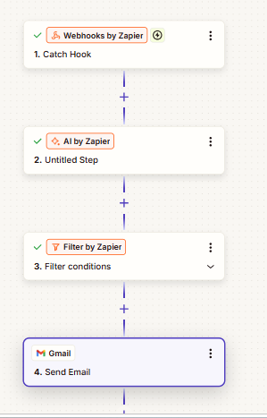
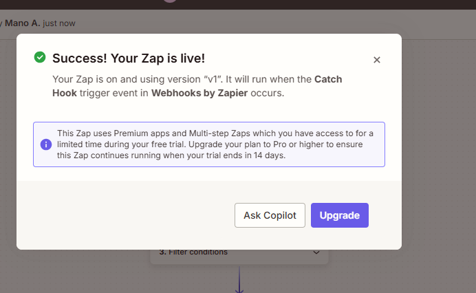
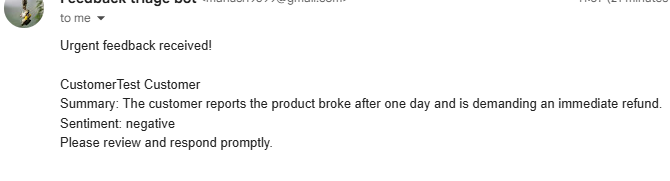

# customer-feedback-triage-automation
# Automated Customer Feedback Triage

## Problem
Support teams manually read through customer feedback to identify urgent 
complaints, which is slow and inconsistent, delaying response to critical issues.

## Solution
An automated workflow that:
1. Receives feedback via webhook
2. Uses AI to classify sentiment, urgency, and generate a summary
3. Filters for high-urgency feedback only
4. Sends an instant email alert for urgent cases

## Architecture
Webhook Trigger → AI Classification (sentiment/urgency/summary) → 
Filter (urgency = high) → Gmail Alert

## Tools Used
- Zapier (workflow orchestration)
- AI by Zapier (sentiment/urgency/summary classification)
- Gmail API (alerting)
- Webhooks, JSON

## Sample Input/Output
**Input:** "This product broke after one day, I want a refund immediately!"

**AI Output:**
- Sentiment: negative
- Urgency: high
- Summary: "The customer reports the product broke after one day and is 
  demanding an immediate refund."

**Result:** Automated email alert sent instantly to the support team.

## Screenshots

## Impact
Eliminates manual triage of feedback, ensures urgent complaints get 
immediate attention instead of being buried in a queue — reducing response 
time from hours to seconds.
